# Muscleverse Gym

Muscleverse Gym is a gym located in Dublin, Ireland. The site is targeted towards all fitness and health enthusiasts no matter their athletic ability. The sites goal is to be clear and concise for the user allowing them to identify the purpose of the site straight away and allow them to quickly identify their next step, to join the gym, check out the classes available and class timetable or to reach out and contact the gym. 

## Features 

- __The landing page image__

  - The landing page image clearly identifies to the user that this is a gym website, its shows a women squatting weights. The image also has a red tint to the corners which ties in with the overall color scheme of the website. 
  - One of the major goals of the gym website is to get more clients signed up to the gym so the image also has a join today button which will re-direct the user to the join today form to sign up to the gym. 
  - The overlay text on the image also lets the user know there is no joining fee for the gym which would benefit the user if they decide to sign up. 

- __Navigation Bar__

  - The responsive Nav bar includes links to the home page, join today form, class timetable and contact section of the home page. The links to the join today form and class timetable will open in seperate tabs allowing the user easy navigation between the pages. 

- __Facilities Section__

  - This section lists the facilities applicable to each of the seperate exercise groups. Strength, Endurance and Tranquility.  
  - Relevant Font Awesome icons were used and the color scheme stays consistent with the overall site theme. 

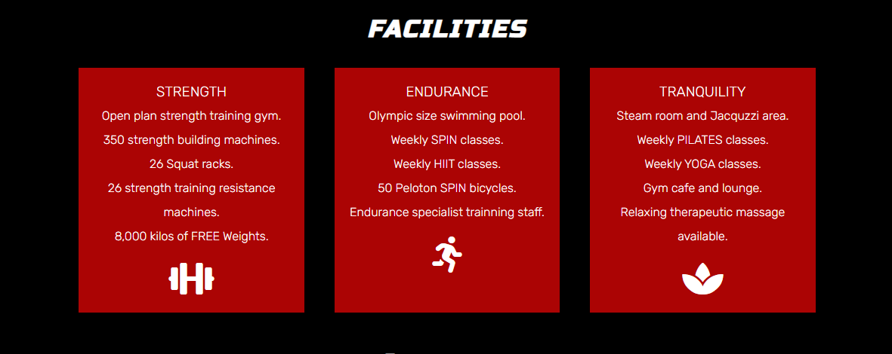

- __Contact Us Section__

  - This section includes a contact us form allowing the user the reach out to the gym with a specific query the website might not cover. The user can also be re-directed to this section from the Nav bar. 
  - A contact details table is also included listing the gym opening hours, email and phone number. The gym address is also listed with a clickable link to a seperate google maps tab. 

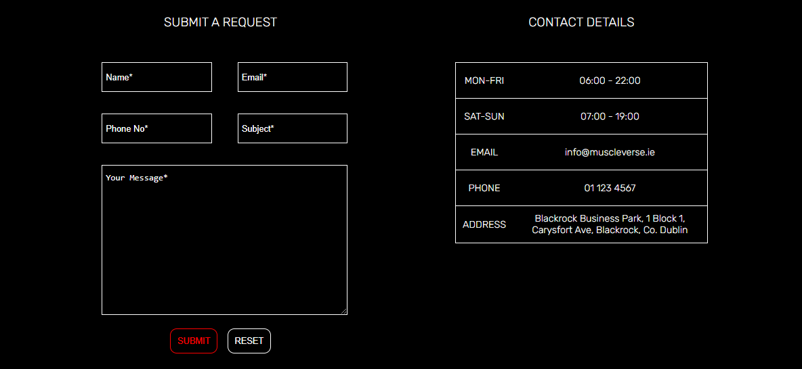

- __Footer Section__ 

  - The footer section was copied directly from the Love Running Project. It offers the user links to the gyms various social media accounts. A hover zoom effect was added to show this icons are clickable to the user. 

- __Join Today Form__

  - This page will allow the user to join the gym after providing the required details and payment. 
  - Users are required to provide their full name, email, phone, date of birth and create a password. These are all features a user would normally expect to provide when signing up to a gym along with their address for any postal correspondance. 
  - Card payment details are required from the user for the €219.00 12 month membership fee listed in the form heading. 

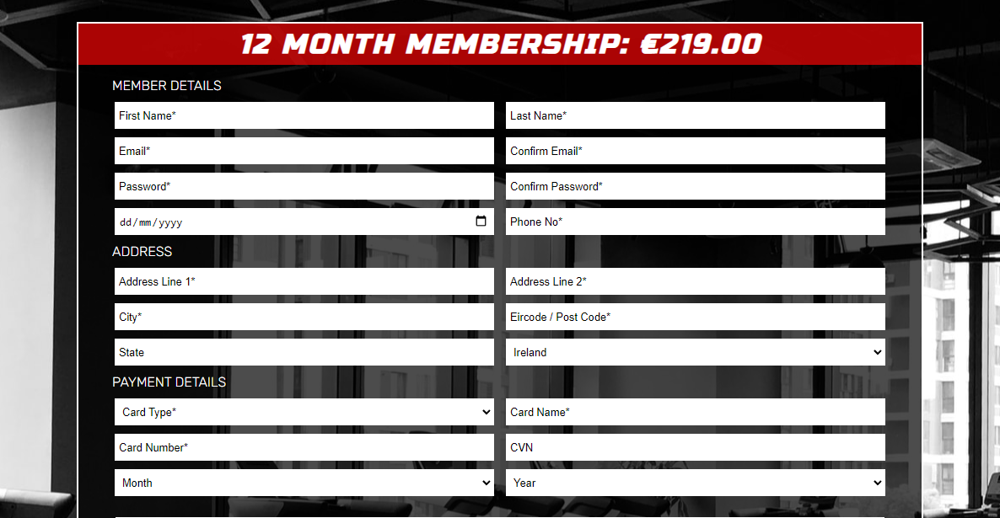

  - The terms and conditions list the rules of the gym to the user which they must read and accept before proceeding with payment. This section is there to protect the user and make sure they are fully aware of the gym rules before signing up. 

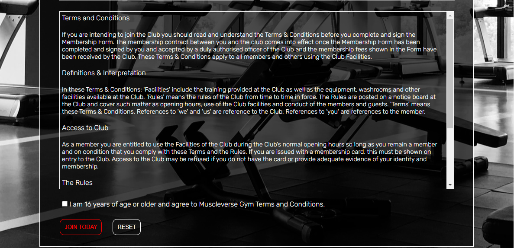

- __Class Timetable__

  - The first table lists the start and finish times of gym classes seven days a week. This page is designed for existing gym users so they can schedule their gym sessions around the class times if they would like to attend. It also gives potential users a chance to view the class schedule before signing up to the gym.

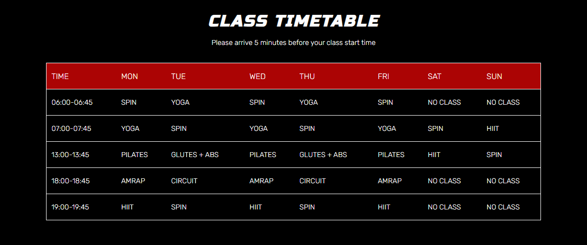

  - The second table provides a full description of each class to the user so they are aware of what takes place at the class before attending. 

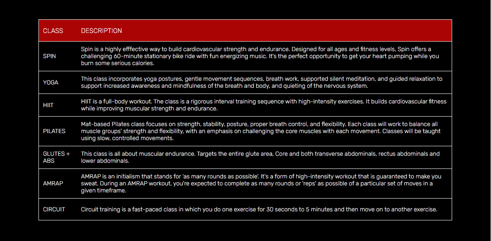

## Testing

- __Validator Testing__

  - Any errors returned when passing through the official W3C validator have been fixed on each html page.

  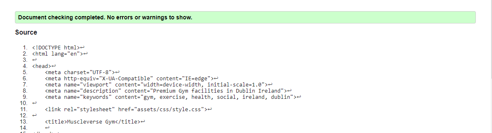

  

  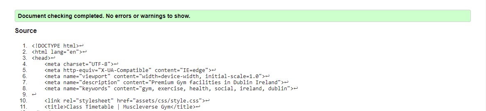

  - CCS - No errors were found when passing through the official (Jigsaw) validator.

  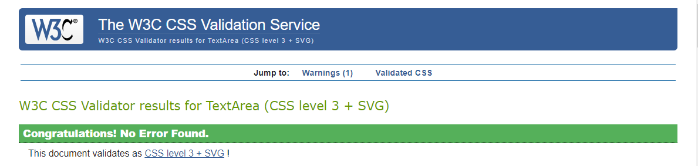

- __Responsive Testing__

  - All 3 project pages were tested on each screen listed below, repsonsive on all screens except for JioPhone2.

  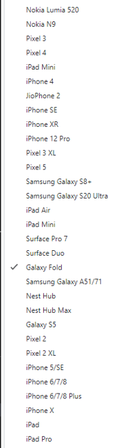, 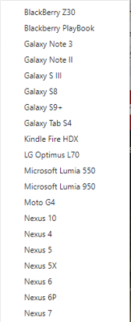

- __User Goal Testing__

  - A first time site user looking to become a gym member. 
    - Upon entry to the site the user will see a clearly layed out navigation bar with the option of joining the gym today. The Join today option is also given to the user with the Join today button on the site's hero image. 
    - Once either join today button is selected by the user they are re-directed in a seperate tab to the join today form allowing them switch freely back to the home page in the seperate tab. 
    - The join form is clear, listing all of the information the user is required to provide in order to join. The 12 month gym membership price is listed in bold text at the top of this form. 

  - A returning user looking for the class timetable. 
    - Upon entry to the site the user will see a clearly layed out navigation bar with the option of class timetable. Upon selection of this button the user will be re-directed to a seperate class timetable page in a new tab. 
    - The class timetable is clear and concise providing the user with the day and time each class will start allowing them to schedule their gym session around the class times.
    - If the user is unsure of the of what takes place in each class they can view the table below the class timetable which provides a brief description of each class. 

## Deployment

  - The site was deployed to GitHub pages. The live link can can be found here - https://evan2022.github.io/html-css-first-project/

## Credits

- __Media__

  - Hero image taken from https://www.pexels.com/.
  - Join form background image taken from https://unsplash.com/. 

- __Content__

  - Icons in the footer and facilities section were taken from https://fontawesome.com/. 
  - Tutorial on the how to use display:flex/flexbox found in https://www.youtube.com/watch?v=JtR2XKFj9tQ&t=3s. 
  - Terms and Conditions text on join today from taken from https://www.contractstore.com/ip-internet/creative/health-club-membership/#prettyphoto/1/ free preview page.

- __Class Descriptions__

  - Spin class description taken from https://www.fitlocalfit.com/Small-Group-Class-Descriptions#:~:text=Spin,you%20burn%20some%20serious%20calories. 
  - Yoga class description taken from https://posabilities4u.com/yoga/yoga-class-descriptions/#:~:text=This%20class%20incorporates%20yoga%20postures,quieting%20of%20the%20nervous%20system. 
  - HIIT class description taken from https://recreation.ucsb.edu/classes-events/group-fitness-cycling/group-fitness-class-descriptions#:~:text=HIIT%20is%20a%20full%2Dbody,and%20walk%20out%20feeling%20strong. 
  - Pilates class description taken from https://www.thepilatesbarrechico.com/class-description#:~:text=Pilates%20Mat,taught%20using%20slow%2C%20controlled%20movements. 
  - Glutes + abs class description taken from https://moveyourframe.com/classes/ass-abs/. 
  - Circuit class description taken from https://recreation.ucsb.edu/classes-events/group-fitness-cycling/group-fitness-class-descriptions#:~:text=Circuit%20training%20is%20a%20fast,and%20slow%20twitch%20muscle%20fibers. 

- __Code__

  - Footer code mostly copied from the Love Running Code Institue projects with minor sizing changes and different hover effects. 
  - The country field select options in the join today form were taken copied https://www.technicalkeeda.com/html-tutorials/all-countries-drop-down-list-in-html. 
  - Onfocus attribute in date of birth filed in join today form was copied from https://www.geeksforgeeks.org/how-to-set-placeholder-value-for-input-type-date-in-html-5/?ref=lbp

